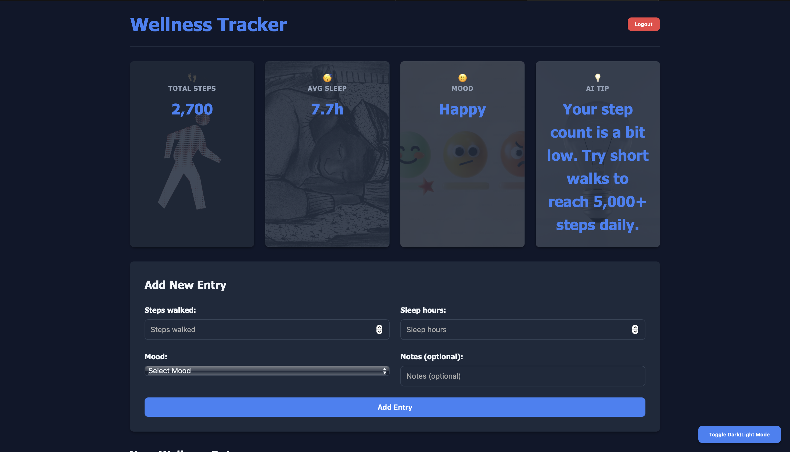
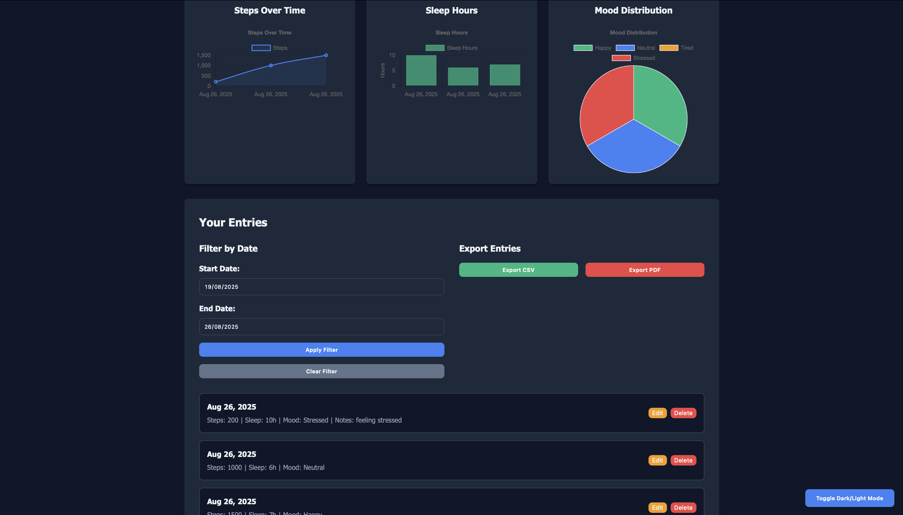

# 🧘 Wellness Tracker

A full-stack wellness tracking application built as part of the **Tech Inject Take-Home Assignment**.  
The app allows users to track their daily wellness metrics (steps, sleep, mood, and notes) with authentication, CRUD operations, data visualization, and AI-powered tips.

---

## 📌 Features

**Authentication** – Sign up, login, logout (Firebase Authentication)  
 **CRUD Operations** – Add, edit, delete daily entries (steps, sleep, mood, notes)  
**Dashboard & Visualization** –  
- **Summary Cards**: Total Steps, Average Sleep, Common Mood  
- **Charts**:  
  - Line chart – Steps over time  
  - Bar chart – Sleep hours  
  - Pie chart – Mood distribution  
**AI-powered Tip** – Personalized daily wellness advice  
**Filters** – View entries by date range  
**Export Data** – Download entries as **CSV** or **PDF**  
**Dark/Light Mode Toggle**  
**Responsive UI** – Built with **TailwindCSS**  

---

## 🛠 Tech Stack

- **Frontend**: HTML, CSS (Tailwind), JavaScript, Chart.js  
- **Backend**: Node.js, Express.js  
- **Database**: Firestore  
- **Authentication**: Firebase Authentication  
- **Other Tools**: jsPDF for PDF export  

---

## 🚀 Getting Started

### 1. Clone Repository
```bash
git clone https://github.com/Manu1806-n/wellness-tracker.git
cd wellness-tracker


### 2. Backend Setup

cd backend
npm install
npm start


### 3. Frontend Setup

cd frontend
# Open index.html with Live Server in VS Code or any local server


🔑 Demo Credentials

Use the following test account to log in:


Email: demo@wellness.com
Password: Demo123!


## 📊 Example Dashboard
	•	Steps Summary
	•	Average Sleep
	•	Mood Distribution
	•	AI Tip Card


)

)


📂 Project Structure

wellness-tracker/
│
├── backend/          # Express.js backend API
│   ├── src/
│   ├── server.js
│   └── ...
│
├── frontend/         # HTML/CSS/JS frontend
│   ├── index.html
│   ├── script.js
│   └── style.css
│
└── README.md


🎯 Bonus Features Implemented
	•	AI-powered personalized tips
	•	Dark/Light theme toggle
	•	Export entries to CSV/PDF


📧 Submission

[Take-Home] Wellness Tracker – Manavi – Full-Stack Engineer
